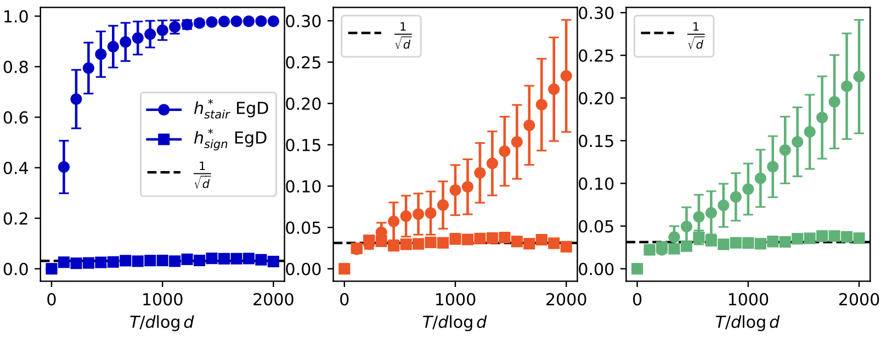

 # Online Learning and Information Exponents: The Importance of Batch size & Time/Complexity Tradeoffs
<div width=auto>
    
</div>

<div style="text-align: center; margin: auto">
    <p><i>
        Example of the new staircase structure emerging in algorithms that repeats data. 
    </i><p>
</div>

### Installation
It requires Python 3.10 or later (not tested on Python later than 3.11). 
```
git submodule update --init --recursive # install boostmath
pip install -r requirements.txt
pip install -e giant-learning --no-binary :all:
```